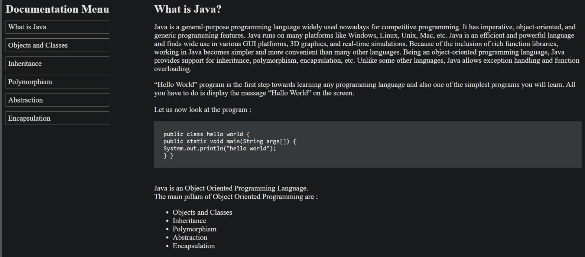
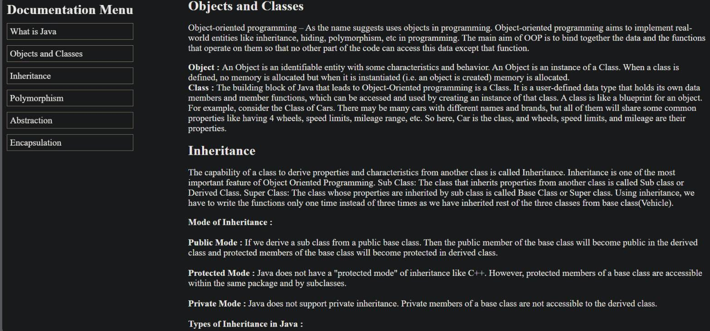
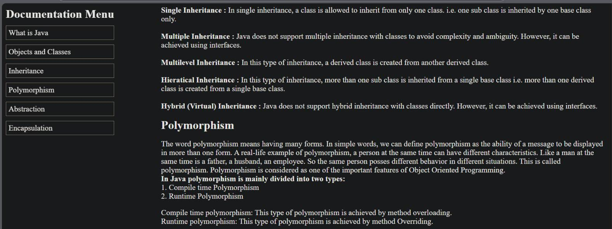
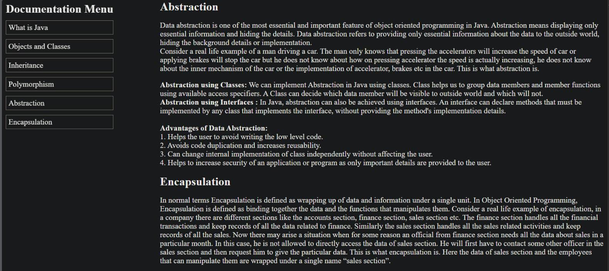

# 📄 Java Documentation Web Page

This is a simple and elegant **Java Documentation Web Page** built using **HTML** and **CSS**, designed to introduce the core concepts of Java's object-oriented programming paradigm. It is ideal for beginners and students to quickly understand fundamental topics like classes, inheritance, polymorphism, abstraction, and encapsulation.

## 📚 Sections Covered

The page is structured into clear and interactive documentation sections:

- **What is Java?**
- **Objects and Classes**
- **Inheritance**
- **Polymorphism**
- **Abstraction**
- **Encapsulation**

Each section includes formatted descriptions, bullet points, and Java code examples to aid understanding.

---

## 🖼️ Screenshots

Below are some screenshots to showcase the design and layout of the documentation:

1. 
2. 
3. 
4. 
5. 

> *(Place your screenshot images in a `screenshots/` folder and ensure they are named accordingly)*

---

## 💡 Features

- Smooth navigation via a sidebar menu
- Clean and readable layout
- Responsive structure (with proper CSS)
- Code snippets and real-life analogies for better understanding

---

## 🛠️ How to Use

1. **Clone or download the repository**
2. Open the `index.html` file in your web browser
3. Ensure the `style.css` and `screenshots/` folder are in the same directory for proper styling and preview

```bash
project-folder/
├── index.html
├── style.css
└── screenshots/
    ├── img1.png
    ├── img2.png
    ├── img3.png
    ├── img4.png
    └── img5.png
```

---

## 🧠 Ideal For

- Java beginners
- College students
- Portfolio or documentation practice
- Educational websites or personal notes

---

## ✨ Customization

You can easily update:
- The sidebar menu items
- Add more Java concepts
- Change the CSS theme (light/dark)
- Embed interactive code playgrounds or quizzes

---

## 📄 License

This project is open-source and free to use for educational or personal learning purposes.

---

## 🙋‍♀️ Author

**Ariba Arzi**  
🔗 [LinkedIn](https://www.linkedin.com/in/aribaarzi2207)  
💻 [GitHub Profile](https://github.com/your-github-handle)
